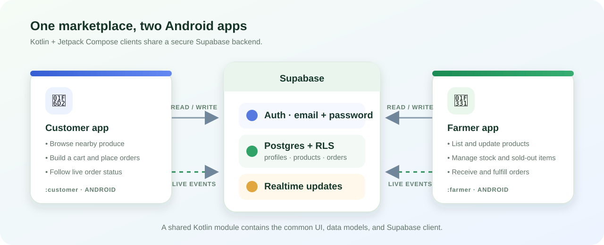
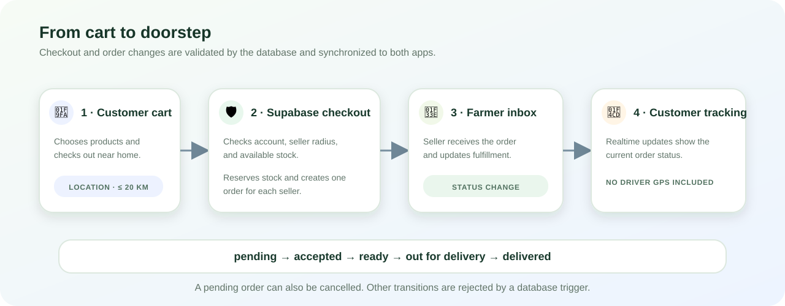

# Farm2Market

Farm2Market is a pair of native Android apps that connect nearby customers with farmers selling fresh produce. The project uses Kotlin, Jetpack Compose, a shared Android library, and Supabase for authentication, PostgreSQL data, and realtime updates.

<p align="center">
  
</p>

## Contents

- [Apps and features](#apps-and-features)
- [How orders move through the app](#how-orders-move-through-the-app)
- [Technology and project layout](#technology-and-project-layout)
- [Requirements](#requirements)
- [Configure Supabase](#configure-supabase)
- [Open and run in Android Studio](#open-and-run-in-android-studio)
- [Run on a USB-connected phone](#run-on-a-usb-connected-phone)
- [Build debug APKs](#build-debug-apks)
- [Troubleshooting](#troubleshooting)
- [Security notes and current scope](#security-notes-and-current-scope)

## Apps and features

| App | Android Studio module | Application ID | Main actions |
| --- | --- | --- | --- |
| Customer | `:customer` | `com.farm2market.customer` | Browse nearby produce, manage a cart, place orders, and track order status. |
| Farmer | `:farmer` | `com.farm2market.farmer` | List products, update available stock, receive orders, and advance order status. |
| Shared library | `:shared` | `com.farm2market.shared` | Shared Compose UI, Supabase client/repository, models, and app theme. |

Both apps use email and password through Supabase Auth. Each account is assigned a `customer` or `farmer` role when its profile is first created. Use separate accounts for the two roles.

### Live marketplace behavior

- Customers see listed produce from farmers within a maximum 20 km radius of the customer's current location.
- Farmer product creation and stock updates are stored in Supabase. Realtime changes to the `products` table trigger a refresh in signed-in apps; quantity `0` represents sold out.
- Checkout calls the database `place_orders` function. It validates the customer, seller range, and requested stock and reserves stock inside the database transaction. A cart containing items from different farms is split into one order per seller.
- Farmers see orders assigned to their account. The farmer app can advance an order through the permitted states, and the customer's order list refreshes from Realtime.

## How orders move through the app

<p align="center">
  
</p>

The allowed status path is `pending → accepted → ready → out_for_delivery → delivered`. A farmer may cancel while an order is pending. The SQL trigger rejects other status changes.

## Technology and project layout

- **Language/UI:** Kotlin and Jetpack Compose
- **Build:** Gradle, Android Gradle Plugin, Kotlin Compose compiler plugin
- **Android:** `minSdk 26` (Android 8.0), `targetSdk 35`, `compileSdk 36`
- **JVM:** Java/Kotlin 17 bytecode; Android Studio's bundled JDK 17 is recommended
- **Backend:** Supabase Auth, Postgres with Row Level Security (RLS), PostgREST RPCs, and Supabase Realtime
- **Location:** Google Play Services Location; location is requested at runtime by each app

```text
.
├── customer_app/android/app/       # Customer Android application
├── farmer_app/android/app/         # Farmer Android application
├── native_shared/                  # Shared Kotlin/Compose/Supabase code (:shared)
├── supabase/schema.sql             # Tables, policies, functions, triggers, Realtime setup
├── docs/images/                    # README diagrams
├── settings.gradle                 # Gradle modules: :customer, :farmer, :shared
├── supabase.properties.example     # Local Supabase configuration template
└── supabase.properties             # Local secrets/config; ignored by Git
```

## Requirements

1. Android Studio with Android SDK Platform 36 installed (Platform 35 is not sufficient for this project's `compileSdk 36`).
2. JDK 17. In Android Studio, select the bundled JDK under **Settings > Build, Execution, Deployment > Build Tools > Gradle > Gradle JDK**.
3. A Supabase project with the schema and app configuration set up below.
4. For a physical-device run, a USB data cable and an Android phone with Developer options and USB debugging enabled.

## Configure Supabase

### 1. Create the database objects

Open the Supabase project dashboard, select **SQL Editor**, and run [`supabase/schema.sql`](supabase/schema.sql). The script defines:

- `profiles`, `products`, `orders`, and `order_items` tables, constraints, and query indexes.
- RLS policies for profiles, farmer-owned products, and buyer/seller order access.
- `ensure_profile`, `nearby_products`, and `place_orders` functions.
- Atomic stock reservation during checkout, product timestamp triggers, and order-status validation.
- Supabase Realtime publication for `products` and `orders`.

The script is written to create or replace its named policies, functions, and triggers. Review schema changes before applying them to an existing production database, and back up important data first.

### 2. Configure email authentication

In **Authentication > Sign In / Providers**, enable Email and disable Phone if the project should use email-only sign-in. The apps use email and password; they do not implement phone login or OTP entry. If **Confirm email** is enabled, a new user must follow Supabase's confirmation link before signing in.

For Android confirmation links to return to the app, add these exact entries under **Authentication > URL Configuration > Redirect URLs**: `farm2market-customer://auth` and `farm2market-farmer://auth`. The customer and farmer apps use separate callbacks.

For signup confirmation to reach users, configure SMTP under **Authentication > Emails > SMTP Settings**. The built-in Supabase mailer is intended for evaluation and has strict delivery limits. For Gmail SMTP, Supabase requires a Google App Password; the regular Gmail password is rejected. Never put SMTP credentials in this repository or Android client.

### 3. Add the project URL and publishable key

Copy the project URL and **publishable key** from the same Supabase project. The publishable key is designed to be used by clients; never use a secret or service-role key in an Android app.

At the repository root, copy `supabase.properties.example` to `supabase.properties`, then replace its placeholders:

```properties
supabase.url=https://YOUR_PROJECT_REF.supabase.co
supabase.publishableKey=sb_publishable_your_project_key
```

The root `supabase.properties` file is excluded by `.gitignore`. Gradle reads it for both app IDs and generates BuildConfig values. Re-sync/rebuild after changing it. Do not commit the populated file.

### 4. Create test accounts

Install each app and register with email/password. Give location permission and a display name to finish creating the role-specific profile. Each account's role is fixed on its first profile creation; use a distinct email/account for the other app. Existing legacy anonymous data is not automatically assigned to a new authenticated account.

## Open and run in Android Studio

1. Open the **repository root** (`Farm2Market`), not one of the nested Android app folders. This root Gradle project includes all three modules.
2. Wait for Gradle sync to finish. If needed, set the Gradle JDK to 17 and install Android SDK Platform 36 from **SDK Manager**.
3. Select the `customer` or `farmer` run configuration/module in the toolbar.
4. Select an emulator or connected phone, then click **Run** to install or **Debug** to start with the debugger attached.

To debug a specific interaction, set a Kotlin breakpoint in `native_shared/src/main/kotlin/com/farm2market/shared/` or the relevant app `MainActivity.kt`, choose **Debug**, and reproduce the action on the device. Supabase request failures are also surfaced in the app UI and can be correlated with the project's **Logs** and **Authentication audit logs** in the dashboard.

## Run on a USB-connected phone

1. On the phone, open **Settings > About phone** and tap **Build number** seven times to enable Developer options. (The exact Settings path varies by manufacturer.)
2. Open **Developer options** and enable **USB debugging**.
3. Connect the phone with a data-capable USB cable. Unlock the phone and accept the **Allow USB debugging?** RSA fingerprint prompt.
4. In Android Studio, wait for the device to appear in the device selector. Choose the desired app configuration and press **Run** or **Debug**.

To confirm the Android Debug Bridge connection from a terminal, run:

```powershell
adb devices
```

The device should appear with state `device`. If it shows `unauthorized`, unlock the phone and accept the RSA prompt. If it is missing, try another USB port/cable, set the phone's USB mode to data/file transfer, and check the manufacturer's USB driver on Windows.

## Build debug APKs

From PowerShell at the repository root:

```powershell
.\gradlew.bat :customer:assembleDebug
.\gradlew.bat :farmer:assembleDebug
```

Or build both in one invocation:

```powershell
.\gradlew.bat :customer:assembleDebug :farmer:assembleDebug
```

On macOS/Linux, use `./gradlew` in place of `.\gradlew.bat`. The debug APKs are generated at:

```text
customer_app/android/app/build/outputs/apk/debug/app-debug.apk
farmer_app/android/app/build/outputs/apk/debug/app-debug.apk
```

Debug APKs are for development and local installation. They are not signed for store release.

## Troubleshooting

| Symptom | Check |
| --- | --- |
| Gradle says SDK 36 is missing | Install **Android SDK Platform 36** from Android Studio's SDK Manager, then sync again. |
| Supabase setup error at sign-in | Check that root `supabase.properties` exists, uses the correct project URL and publishable key, and is not blank; rebuild after editing. |
| Signup returns an email/SMTP error | Review Auth logs in Supabase. Confirm SMTP is enabled and credentials are accepted by the provider. Gmail requires an App Password, not the normal account password. |
| Customer sees no nearby produce | Allow location access, confirm the profile location was saved, and check that a farmer account has listed products with positive stock within 20 km. |
| Farmer does not see a customer's order | Make sure the farmer app is signed in to the seller account for the ordered product and that both apps point to the same Supabase project. Check RLS policies/schema and Auth session. |
| Product/order changes do not refresh live | Check that the schema added `products` and `orders` to `supabase_realtime`, the device has network access, and the signed-in app remains open. Refreshing/reopening the screen also fetches data again. |
| USB device does not appear | Unlock the phone, accept the USB debugging prompt, run `adb devices`, and check the cable/Windows USB driver. |

## Security notes and current scope

- Keep SMTP passwords and service-role/secret Supabase keys out of the client and Git. Only the public project URL and publishable key belong in the local Android configuration.
- RLS limits data access by authenticated account and role. Do not remove RLS policies or expose service credentials to make a client request work.
- Location permission is used to find produce and validate nearby orders. The database caps marketplace/order distance at 20 km.
- The current apps support order placement and seller-updated status tracking. They do not process payments or provide driver GPS tracking or dispatch.
